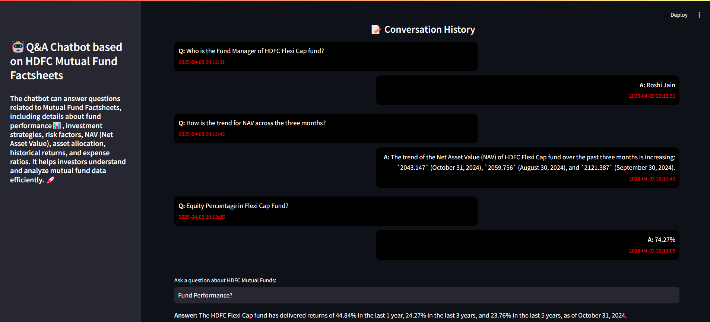

# 📊 HDFC Mutual Fund Q&A Chatbot

This project is a Q&A chatbot that allows users to query HDFC Mutual Fund factsheets using Retrieval-Augmented Generation (RAG) with LangGraph. The chatbot extracts data from multiple documents, processes it into retrievable chunks, and responds to user queries intelligently.

## 🛠️ Features
- **Conversational Q&A**: Ask queries related to HDFC Mutual Funds.
- **Retrieval-Augmented Generation (RAG)**: Uses document-based retrieval to enhance responses.
- **Streamlit Web Interface**: Interactive UI for user-friendly experience.
- **LangGraph Workflow**: Utilizes LangGraph to structure the chatbot pipeline.
- **Efficient Indexing**: Splits and stores text efficiently for faster retrieval.

## 🚀 Installation & Setup
### 1️⃣ Clone the Repository
```sh
git clone https://github.com/your-username/HDFC-LangGraph-QA-Chatbot.git
cd HDFC-LangGraph-QA-Chatbot
```

### 2️⃣ Create a Virtual Environment
```sh
python -m venv venv
source venv/bin/activate  # On macOS/Linux
venv\Scripts\activate    # On Windows
```

### 3️⃣ Install Dependencies
```sh
pip install -r requirements.txt
```

### 4️⃣ Add API Keys Securely
Create a `.env` file and add your API keys without exposing them in the code:
```sh
touch .env
nano .env  # Add the following inside
```
```
GROQ_API_KEY=your_api_key_here
```
Load environment variables in the script:
```python
from dotenv import load_dotenv
import os
load_dotenv()
API_KEY = os.getenv("GROQ_API_KEY")
```

### 5️⃣ Run the Chatbot
```sh
streamlit run app.py
```

## 📸 Screenshots


## 📂 Project Structure
```
HDFC-LangGraph-QA-Chatbot/
│── data/                  # Store mutual fund documents
│── src/                   # Core chatbot logic
│   ├── RAG_with_Langgraph.py  # RAG implementation with LangGraph
│── app.py                 # Streamlit frontend
│── requirements.txt        # Dependencies
│── .gitignore              # Ignore sensitive files
│── .env.example            # Template for environment variables
│── README.md               # Project documentation
```

## 🤝 Contributing
Feel free to open issues or submit pull requests to enhance the project!

## 📜 License
This project is licensed under the MIT License.

---


