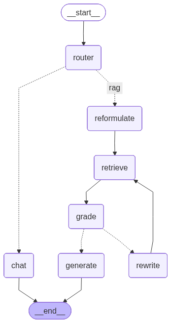
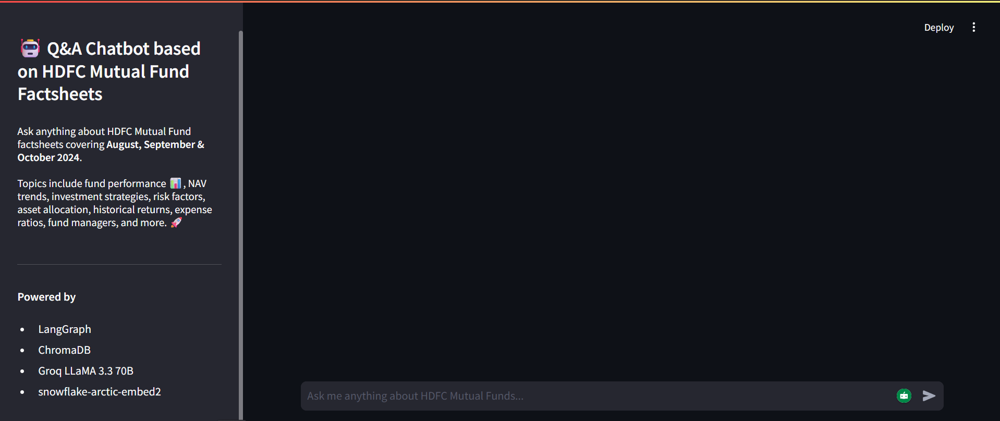
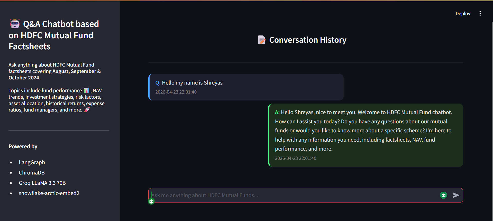
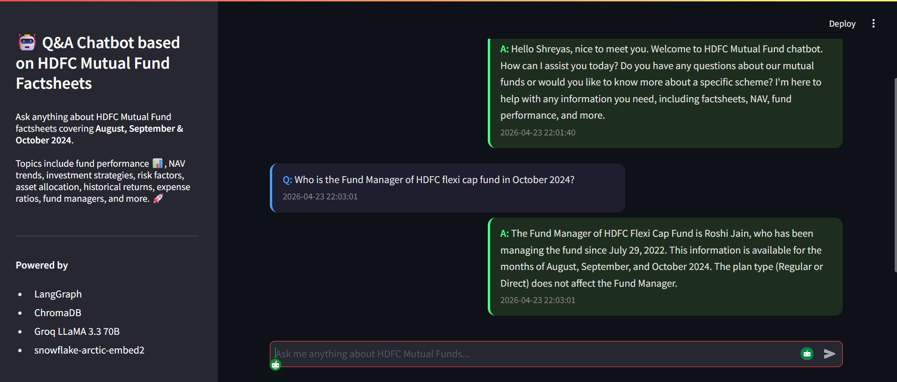
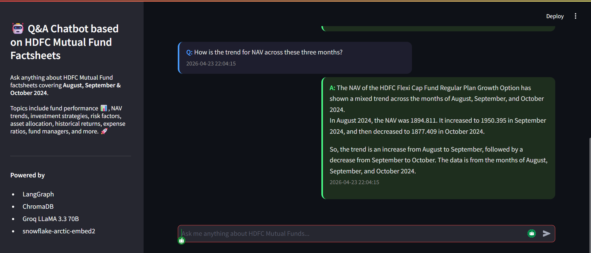

# 📊 HDFC Mutual Fund Q&A Chatbot

A conversational RAG chatbot that answers questions about HDFC Mutual Fund factsheets (August, September & October 2024). Built with **LangGraph**, **ChromaDB**, **Groq LLaMA 3.3 70B**, and **Streamlit**.

---

## 🏗️ Architecture - Corrective RAG with LangGraph

The pipeline is implemented as a **7-node LangGraph StateGraph** with two conditional branches and a retry loop:

```
START --> router --> [chat]  --> END
                --> reformulate --> retrieve --> grade --> [generate] --> END
                                                       --> rewrite --> retrieve (retry loop)
```

| Node | Role |
|---|---|
| `router` | Classifies message as `rag` (factsheet query) or `chat` (general conversation) |
| `reformulate` | Rewrites follow-up questions into standalone queries using chat history |
| `retrieve` | Fetches top-4 chunks per PDF (12 total) filtered by source file |
| `grade` | LLM judges whether retrieved context is relevant enough to answer |
| `rewrite` | Rewrites the query with different keywords if context was irrelevant (max 2 retries) |
| `generate` | Produces the final answer grounded in retrieved context |
| `chat` | Handles general conversation without touching the vector store |

This is **Corrective RAG** - if retrieval fails the relevance check, the query is rewritten and retrieval is retried before generating an answer.

---

## ✨ Features

- **Intelligent routing** - greetings and small talk handled naturally without triggering RAG
- **Corrective RAG loop** - automatic query rewriting on retrieval failure (up to 2 retries)
- **Multi-turn conversation** - chat history maintained across turns; follow-up questions resolved to standalone queries
- **Accurate NAV retrieval** - dedicated NAV summary documents pre-extracted from the two-column PDF layout, preventing portfolio text from dominating similarity search
- **Per-source retrieval** - fetches from each of the 3 factsheets independently, guaranteeing all months appear in context
- **LLM fallback** - Groq (primary) with local Ollama as fallback via `.with_fallbacks()`
- **Styled Streamlit UI** - chat cards with Q/A layout, timestamps, and conversation history

---

## 🛠️ Tech Stack

| Component | Technology |
|---|---|
| Orchestration | LangGraph (StateGraph) |
| Vector Store | ChromaDB (persistent, local) |
| Embeddings | snowflake-arctic-embed2 via Ollama |
| LLM (primary) | Groq - LLaMA 3.3 70B Versatile |
| LLM (fallback) | Ollama - gpt-oss:20b (local) |
| PDF Parsing | PyMuPDF (fitz) |
| UI | Streamlit |

---

## 🚀 Setup & Run

### 1. Clone the repository
```bash
git clone https://github.com/Varadkar45/LangGraph_based_Mutual_Fund_Q-A_Chatbot.git
cd LangGraph_based_Mutual_Fund_Q-A_Chatbot
```

### 2. Create a virtual environment
```bash
python -m venv venv
venv\Scripts\activate        # Windows
# source venv/bin/activate   # macOS/Linux
```

### 3. Install dependencies
```bash
cd 2.0
pip install -r requirements.txt
```

### 4. Start Ollama (required for embeddings)
```bash
ollama pull snowflake-arctic-embed2
ollama serve
```

### 5. Add your Groq API key
Create a `.env` file in the project root:
```
GROQ_API_KEY=your_groq_api_key_here
```

### 6. Add factsheet PDFs
Place the three HDFC factsheet PDFs in the `factsheets/` folder:
```
factsheets/
    HDFC_MF_Factsheet_August_2024.pdf
    HDFC_MF_Factsheet_September_2024_0.pdf
    HDFC_MF_Factsheet_October_2024.pdf
```

### 7. Run the chatbot
```bash
streamlit run app.py
```

The vector store is built automatically on first run and persisted to `chroma_db/`.

---

## 📂 Project Structure

```
LangGraph_based_Mutual_Fund_Q-A_Chatbot/
|-- factsheets/                    # Input PDFs
|-- 2.0/                           # Latest version
|   |-- rag_pipeline.py            # LangGraph graph, ChromaDB, all 7 nodes
|   |-- app.py                     # Streamlit UI
|   |-- requirements.txt           # Dependencies
|   |-- workflow_diagram.png       # Auto-generated LangGraph diagram
|   +-- outputs/                   # Screenshots
+-- README.md
```

---

## 📸 Workflow Diagram



## 📸 Screenshots

**Homepage - Streamlit UI with sidebar and chat input**


**General conversation - Router node handles greetings without triggering RAG**


**Fund manager query - Accurate retrieval from factsheet context**


**NAV trend query - Multi-month comparison across August, September & October 2024**


